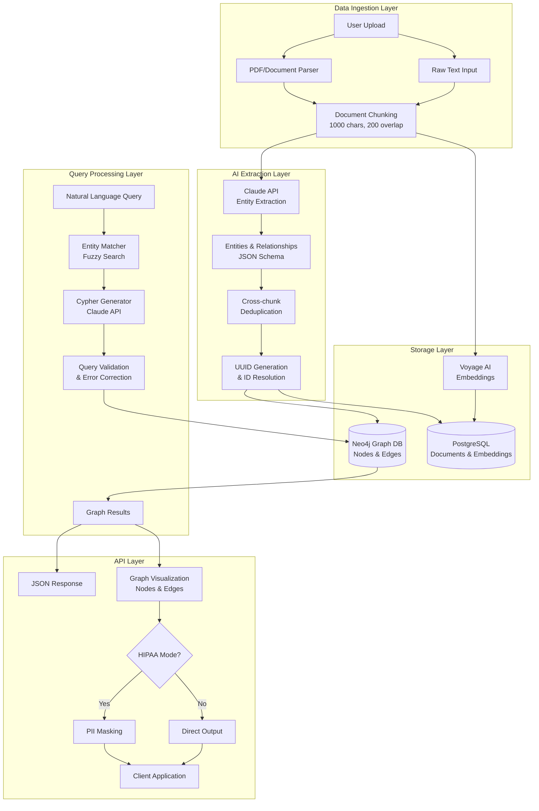

# Solyd

> The Clinical Intelligence Platform - Turn medical chaos into clinical clarity with AI-powered knowledge graphs

## Inspiration

The pandemic exposed a critical gap in healthcare: while medical data is growing exponentially, most of it remains trapped in unstructured formats. Even though expert clinicians write high-quality data, these insights stay locked away and inaccessible when needed most. We built Solyd to become the Clinical Intelligence Platform, transforming all medical data into a unified, queryable knowledge base that powers solyd clinical decisions.

## What it does

Solyd extracts entities and relationships from unstructured medical data to build a comprehensive knowledge graph. Clinicians can query this graph using natural language to instantly find relevant patient histories, treatment patterns, and clinical insights. The platform visualizes complex medical relationships, enabling transparent decision-making while AI agents handle routine tasks so doctors can focus on patient care.

## How we built it

We built a Neo4j graph database as our core, using Claude API to extract entities and relationships from unstructured text. Our pipeline handles cross-document entity resolution, deduplication, and relationship mapping. Natural language queries are converted to Cypher through Claude, with error correction and query optimization. The frontend visualizes the knowledge graph using Sigma.js, while LiveKit and Cerebras power voice-enabled AI agents for hands-free interaction.

## Individual Contributions

Ryan built the graph-based data layer and natural language extraction backend, creating the core engine for entity extraction and query processing. Rohit developed the clinical platform frontend, enabling seamless data upload and interactive visualization of the extraction process. Advita constructed AI agents that automate routine clinical workflows based on the knowledge graph. Kush integrated agent mapping capabilities and transparency features to ensure explainable AI decisions.

## Challenges we ran into

Graph databases were new territory. Neo4j's node-edge concepts differ from theoretical graph models, so we had to refactor our schema twice. D3.js was too low-level for our timeline, while simpler libraries could not handle the complexity needed for clinical decision support. We built an MVP with basic libraries, then added custom visualization layers. Our team's different AI SDKs caused integration conflicts, which we solved with a master-sub agent architecture that streamlined development and user interaction.

## Accomplishments that we're proud of

We built a robust system that extracts entities and relationships from any unstructured medical text. While NL2SQL is common, graph query generation is rare and error-prone. We solved this with query validation and self-correction. Our visualization layer displays complete medical relationships and supports iterative exploration for non-technical users. We implemented HIPAA compliance with PII masking through AI and pattern recognition, making this production-ready for clinical environments.

## What we learned

Clear role definition accelerates development. When technical roadblocks appear, having a well-defined goal lets you find alternative routes that often prove superior to the original approach. Sometimes the detour becomes the highway.

## What's next for our project

We'll implement data quarantine for enhanced reliability, enable dynamic entity type expansion as medical knowledge evolves, and build advanced visualization layers for complex relationship analysis. Full HIPAA certification and enterprise security features will make Solyd ready for hospital-wide deployment, turning it from a prototype into the clinical decision platform healthcare needs.

## Backend Data Layer Architecture

